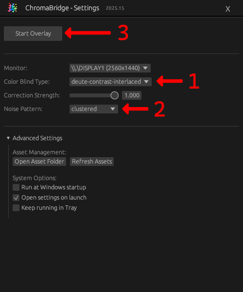

<p align="center">
  
</p>
<p align="center" style="font-size:40px">
  ChromaBridge 
</p>
</br>
An easy to use and low latency color blindness tool for simulated trichromatism.  

## Quick Start Guide
Download and Install ChromaBridge by clicking [HERE](https://github.com/99oblivius/ChromaBridge/releases/latest/download/ChromaBridge-Setup-2025.35.exe).

<table>
  <tr>
    <td>
      
    </td>
    <td>
      <b>Step 1:</b> Select the color blind type. Currently ships with two deutan spectra.<br><br>
        - <b><u>contrast-interlaced</u></b> makes contrasts perceptually similar to trichromats.<br>
        - <b><u>true-interlaced</u></b> does not shift true blue and yellow.<br><br>
      <b>Step 2:</b> Select an Interlace Pattern to simulate trichromia.<br><br>
      <b>Step 3:</b> Press <b><u>Start Overlay</u></b>
    </td>
  </tr>
</table>

## User Interface
### Menu
  
<sub>Click the menu's application icon (top left) rapidly five times to enable Developer options</sub>

### System Tray
Left click to open settings.  
Right click:
- **Open Settings**
- **Enable Overlay** - Toggle overlay
- **Exit** - Close application

</br>

## Features
- **Real-time GPU acceleration**: Ultra-low latency and negligable performance impact (suited for running video games alongside)
- **Multi-monitor support**: Automatic refresh rate detection
- **Automatic startup** option launches ChromaBridge when Windows starts
## Limitations
- Minimum 1 frame latency
- Currently only implemented for Windows 10/11
- One overlay per display (multiple ChromaBridge instances can run concurrently)
## Installation
The latest installation binary is available here **[[Releases]](https://github.com/99oblivius/ChromaBridge/releases)**  
The installer will walk you through installing the ChromaBridge application to your user account.
- **Install Location**: `%LOCALAPPDATA%\ChromaBridge\`
- **Appdata Location**: `%APPDATA%\ChromaBridge\`
- **Optional Shortcuts**: Start Menu and Desktop
- Includes Uninstaller
## Building
### Prerequisites
- **Rust** toolchain (MSRV 2021 edition)
- **Windows** 10/11 (required for DirectComposition + D3D11)
- **NSIS** (for installer creation with `./build-installer.ps1`)
### Build Binary
`./build-installer.ps1` builds for release and places installer at `target/ChromaBridge-Setup.exe`

OR  
```powershell
cargo build --release
```
### Adding new Spectra
1. Create JSON file in `chromabridge\assets\spectrums\`
2. Test with `visualize_spectrum.py` (tested with Python 3.13+ and requires PIL + numpy)
3. View output spectra in `chromabridge\tools\output\`
4. Copy JSON to `%APPDATA%\ChromaBridge\assets\spectrums\`
5. Refresh assets in ChromaBridge settings
#### Spectrum example
**Node-Based**
```json
{
  "spectra": [
    {
      "nodes": [
        {"color": "#FF0000", "position": 0.0},
        {"color": "#00FF00", "position": 0.333},
        {"color": "#0000FF", "position": 0.667},
        {"color": "#FF0000", "position": 1.0}
      ]
    }
  ]
}
```
`spectra` value supports a list of spectra described by nodes ranging between position 0.0 and 1.0 (float).  
ChromaBridge currently supports single or double spectra for interlacing by noise textures.
## Versioning
ChromaBridge follows the versioning format: `0.YEAR.COMMIT_COUNT`
- **Year**: Current calendar year
- **Commit Count**: Total number of commits in the repository

Example: `0.2025.29` represents the 29th commit in the year 2025.
## Acknowledgements
This project was inspired by Kilian-Roy Lachner's [Custom Color Vision](https://www.color-in-color.info/color-in-color/custom-color-vision) application. Their research and discoveries in regards to "functional trichomacy for the colorblind" enabled this project. 